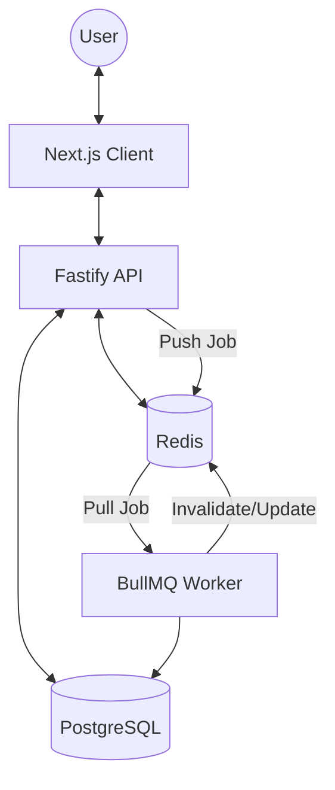

# System Architecture - Lumbung (Inventory Management)

## Executive Summary
Lumbung is a corporate-grade Warehouse Management System (WMS) designed for multi-tenant scalability and offline resilience. The architecture follows a **Movement-Based** inventory design, ensuring an immutable audit trail for every stock change.

### Business Impact
- **Latency Reduction**: Caching hot data (Products, Stock Summary) in Redis reduces DB load by ~80%.
- **Reliability**: Asynchronous background jobs (BullMQ) ensure critical actions (Email, Stock Recalculation) never block the UI.
- **Offline Readiness**: Local-first entry (Dexie) with an Outbox pattern ensures data integrity during sync.

---

## Component Diagram

---

## Data Flow: Inventory Adjustment
1. **Request**: UI sends an adjustment request to Backend.
2. **Transaction**: Backend starts a DB Transaction:
   - Create `StockAdjustment`.
   - Create `InventoryMovement` (Audit Log).
   - Create `OutboxEvent` (for async processing).
3. **Async Processing**: 
   - `OutboxEvent` is picked up by a worker.
   - Worker recalculates `InventoryItem` (Read Model/Summary).
   - Worker invalidates Redis cache for that Product/Warehouse.
4. **UI Update**: UI refreshes data (either via polling or simple refresh).

---

## Environment Toggles (NFR)
Manage features via `.env` without code changes:
| Key | Default | Description |
|-----|---------|-------------|
| `ENABLE_REDIS_CACHE` | `true` | Toggle backend cache layer. |
| `ENABLE_QUEUE` | `true` | Toggle BullMQ job processing. |
| `REDIS_URL` | `redis://localhost:6379` | Connection string. |
| `CACHE_TTL` | `3600` | Default cache expiry in seconds. |

---

## Tech Stack (Existing vs Proposed)
- **Runtime**: Node.js (Existing)
- **API Framework**: Fastify (Existing)
- **Database**: PostgreSQL + Prisma (Existing)
- **Cache & Jobs**: **Redis + BullMQ** (Proposed/Implementing)
- **Frontend**: Next.js + React Query + Tailwind (Existing)

[Next: Caching Strategy](./CACHING_STRATEGY.md) | [Redis Usage Guide](./REDIS_USAGE_GUIDE.md) | [Queue Guide](./QUEUE_ASYNC_PROCESSING.md)
