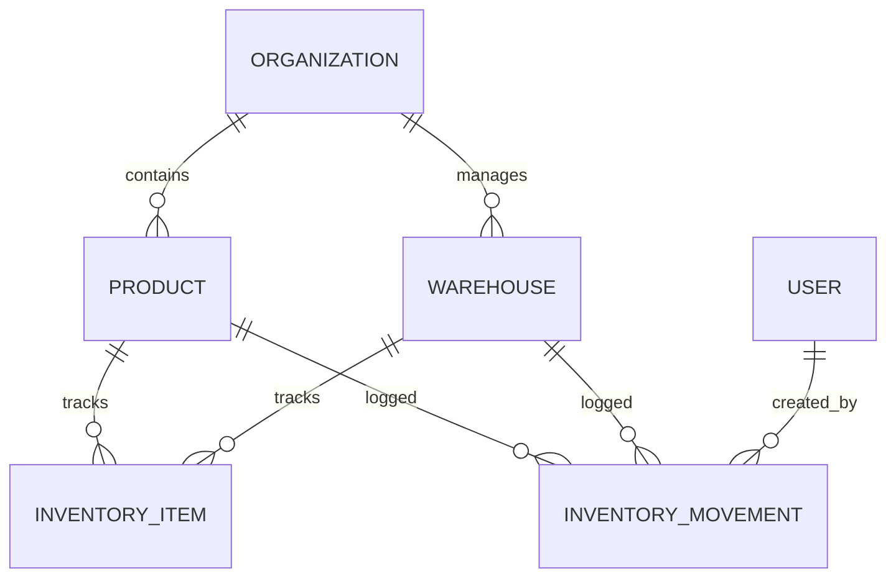

# Database Schema Design

Lumbung uses a **Ledge-style (Movement-based)** architecture to ensure auditability and precision.

## 1. Core Models Summary
- **Organization**: Root of multi-tenancy.
- **Product**: Catalog item with SKU and cached `costPrice`/`sellingPrice`.
- **Warehouse**: Physical or virtual inventory location.
- **InventoryItem**: De-normalized aggregate (Product + Warehouse) for fast current-stock lookups.
- **InventoryMovement**: The immutable source of truth for every stock change (IN, OUT, ADJUST, TRANSFER).

## 2. ER Diagram

## 3. Critical Constraints
- **Multi-Tenancy**: Almost all tables have `organizationId`. Queries MUST include this index.
- **SKU Uniqueness**: `@@unique([organizationId, sku])`.
- **Inventory Consistency**: `InventoryItem` is updated by DB triggers or background workers to match the sum of `InventoryMovement`.

## 4. Proposed Tables for Scalability
| Table | Description |
|-------|-------------|
| `OutboxEvent` | Buffer for asynchronous tasks (Redis Jobs). |
| `AuditLog` | Broader system activity tracking (optional). |

---

[Back to Architecture](./ARCHITECTURE.md)
