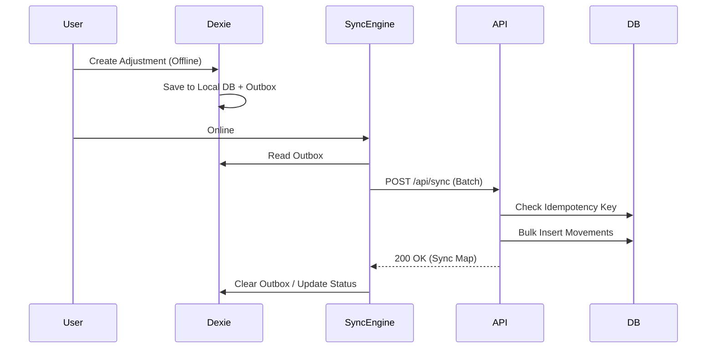

# Offline Sync Strategy

Lumbung is built with a local-first mindset to handle unstable warehouse network connections.

## 1. Client-Side Storage
- **Library**: `Dexie.js` (Wrapper for IndexedDB).
- **Scope**: Product lookup, Category list, Pending Movements.

## 2. The Bridge: Sync Engine
The sync process is **Asynchronous and ID-consistent**.

### Workflow:
1. **Offline Mode**: 
   - User creates an Adjustment.
   - Entry saved to Dexie `pending_movements`.
   - Entry added to Dexie `outbox`.
2. **Re-connection**:
   - Client detects network.
   - Client sends `outbox` batch to Backend `/api/sync` endpoint.
3. **Backend Conflict Resolution**:
   - Backend performs **Idempotency Check** using UUID generated on Client.
   - If acceptable, writes to `InventoryMovement` as a new ledger entry.
   - If conflict (e.g., product deleted while offline), returns error and flags record in Dexie.

## 3. Conflict Resolution Policy
We use **Ledger-Based Resolution** (Last Write Wins per Item is avoided).
- Every adjustment is an additive movement.
- Source of Truth is always the calculated sum of movements in the DB.

## 4. Sequence Diagram

---

## 5. Security
Sync tokens must match the active Organization ID and User Session.

[Architecture Home](./ARCHITECTURE.md)
