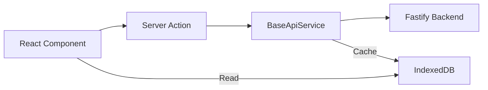

# Frontend Architecture: Dashboard

## Overview
The Lumbung frontend is built with **Next.js 14 (App Router)** using a **Neo-Brutalist** design system. It is designed for maximum performance, offline resilience, and cross-platform consistency.

## Directory Structure Audit

### 1. `src/app/[locale]/(dashboard)`
Contains the main page routes.
- **`inventory`**: Stocks, Warehouses, Suppliers, Categories.
- **`sales-orders`**: Customer management and order fulfillment.
- **`purchase-orders`**: Procurement and receiving.
- **`settings`**: Organization and system configuration.

### 2. `src/components`
- **`ui/`**: Low-level Radix UI based components (Buttons, Inputs, Dialogs).
- **`shared/`**: Generic UI patterns (LanguageSwitcher, StatsCard, NeoTable).
- **`domain/`**: Entity-specific components (InventoryTable, category-modal).
- **`layout/`**: Core structures (Sidebar, Topbar, BrandLogo).

### 3. `src/lib/services`
Abstraction layer for API calls.
- **Enterprise Pattern**: Every service now inherits from `BaseApiService`.
- **Offline First**: Automatic caching to **Dexie.js (IndexedDB)** is handled by the base service, allowing users to see data even when the backend is unreachable.

## Architecture Principles

### 🟢 Developer Friendly (Beginner)
- **Typed Actions**: Uses Next.js Server Actions for forms, making it easy to understand data flow without complex Redux/State managers.
- **Simple Services**: Services are easy to read and modify.
- **No Placeholders**: Real images and data are used throughout.

### 🏢 Enterprise Friendly (Scalable)
- **RBAC Ready**: Middleware and `rbac.ts` handle access control.
- **i18n**: Full internationalization support with `next-intl`.
- **Query Caching**: Uses **React Query** for server-state management.
- **Batch Processing**: Optimized inventory tracking using batch-centric models.

## Page Summary

| Page | Features | Components |
| :--- | :--- | :--- |
| **Dashboard** | Analytics, Recent Activity | `StatsCard`, `Charts` |
| **Inventory** | Batch tracking, FIFO costs | `InventoryTable`, `BatchDropdown` |
| **Sales** | Order fulfillment, Tracking | `OrderList`, `StatusBadge` |
| **Settings** | Organization management | `OrgForm`, `ProfileCard` |

## Proposed Improvements (Shared Components)
- [ ] **Unified Entity Modal**: Consolidate Create/Edit modals of simple entities (Categories, Warehouses) into a single reusable component.
- [ ] **BaseCRUDTable**: Abstract common table behaviors (pagination, search, export) into a single high-level component.
- [ ] **Error Boundaries**: Add per-section error boundaries to prevent one failed component from crashing the entire page.

## Data Flow Diagram

